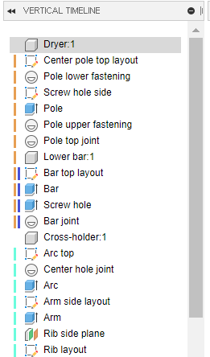

# VerticalTimeline

A Fusion 360 add-in that adds a vertical timeline.

The functionality is limited at this point  (see [Usage](#usage)) and performance need to be improved for use with large files.

## Installation

Download the add-in from the [Releases](https://github.com/thomasa88/VerticalTimeline/releases) page.

Unpack it into `API\AddIns` (see [How to install an add-in or script in Fusion 360](https://knowledge.autodesk.com/support/fusion-360/troubleshooting/caas/sfdcarticles/sfdcarticles/How-to-install-an-ADD-IN-and-Script-in-Fusion-360.html)).

Make sure the directory is named `VerticalTimeline`, with no suffix.

## Usage

Press Shift+S in Fusion 360 and go to the *Add-Ins* tab. Then select the add-in and click the *Run* button. Optionally select *Run on Startup*.

The timeline is shown using *File* -> *View* -> *Toggle Vertical Timeline*.

* Click an item to select it*.
* Double-click on an item to edit it*.
* Click on an item text to rename it.
* Right click an item to roll to it.

 \* See TODO.

## TODO

* Improve performance

* Fix nested coloring not reused in new documents.

* Highlight feature selected in the Fusion GUI.

* Less intrusive error messages.

* Correctly select and edit primitive features (e.g. *Box*) that are inside components.

* Fix broken functionality once Fusion fixes its bugs

  * Cannot show all feature images due to bug: [[API BUG] Cannot access entity of "Move" feature](https://forums.autodesk.com/t5/fusion-360-api-and-scripts/api-bug-cannot-access-entity-of-quot-move-quot-feature/m-p/9651921)

  * Workaround for document switching since documentActivated is broken. [[API BUG] Application.documentActivated Event do not raise](https://forums.autodesk.com/t5/fusion-360-api-and-scripts/api-bug-application-documentactivated-event-do-not-raise/m-p/9020750)

## Changelog

* v 0.2.0
  * Fix selection of features inside components/occurrences.
  * Allow selection of rolled back and suppressed features.
